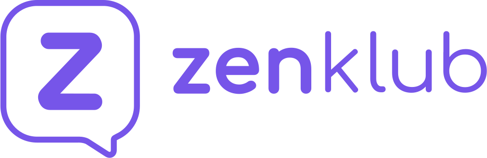

# 💜 Vem pro [Zen](https://www.zenklub.com.br) - Backend Engineer! 

Aqui no [Zenklub](https://www.zenklub.com.br) trabalhamos em times. Nosso time é multidisciplinar, com foco no produto e na evolução tecnológica dos nossos sistemas. 

Em um ambiente descontraído, prezamos pela qualidade e participação ativa dos desenvolvedores na construção da nossa plataforma. Temos um carinho especial pelo usuário, direcionando nossas decisões pela experiência e fazendo constantes ajustes para alinhar os nossos sistemas com as necessidades do mercado.

Hoje trabalhamos com alguns grandes produtos:

- **Zenklub Para Usuários**: uma ferramenta que tem como objetivo auxiliar pessoas comuns, como eu e você em suas jornadas de saúde mental, oferecendo conteúdos exclusivos e uma vasta lista de profissionais (use e veja **;)**);
- **ZenOffice para Profissionais**: o consultório online dos profissionais, ajudamos os profissionais a organizarem o trabalho, e economizarem ao optarem por um escritório online no lugar de um escritório físico.
- **B2B**: além dos usuários e profissionais, empresas são clientes importantes no nosso dia a dia, e por isto temos uma equipe dedicada a eles.

Afetamos diariamente milhares de pessoas, e temos o constante desafio de democratizar o acesso à saúde mental, e para isto precisamos usar todos os canais disponíveis: web, mobile e plataforma para a divulgação de conteúdo, aquisição de usuários e a manutenção devida de algumas informações. Por isto estamos discutindo constantemente o papel de tecnologia na evolução do produto e na experiência dos usuários e clientes como um todo.

No **zenklub** equipes de tecnologia, design e produto trabalham muito próximas umas das outras.ipe de design e produto.

## ✨ Nossa Stack
Hoje trabalhamos principalmente com `node.js`. De forma simplificada nossa stack tem:

- typescript
- serverless
- kubernetes
- postgres
- mongo
- elasticsearch
- firebase
- prometheus
- loki

### ⭐ Gostou de tudo que está aí em cima? Então vem pra cá!!!

Dá uma olhada no nosso [repositório principal](https://github.com/Zenklub/vem-pro-zen), lá você encontrará detalhes sobre como trabalhamos! Aqui vamos focar no desafio técnico de backend!

## ⭐ O Desafio

Este desafio é a primeira parte do nosso processo de entrevistas para avaliar suas skills técnicas. A coisa mais importante a se ter em mente é que não existe apenas uma resposta certa quando estamos falando em desenvolvimento, o objetivo deste desafio é nos mostrar quem você é como pessoa desenvolvedora de software, mais importante do que resolver ou não é o que você nos mostrou com o que criou.

Se tiver qualquer dúvida, nos procure em  `jobs[arroba]zenklub[ponto]com`

Imagine o seguinte cenário: temos usuários procurando profissionais para se consultarem, e tems profissionais que disponibilizam horários nos quais estão disponíveis para atender estes clientes.

Para que isto funcione, temos um sistema de gerenciamento de disponibilidades dos profissionais, isto existe no nosso sistema e é isto que você, Backend Engineer vai fazer neste desafio.

## ✔️ Regras de Negócio
- Para que nossos profissionais gerenciem suas disponibilidades, precisamos de um sistema de gerenciamento de slots de tempo
- Profissionais precisam definir quais dias da semana estarão disponíveis e um ou mias intervalos de tempo para cada dia
- Um slot de disponibilidade tem duração de 30 minutos. Por exemplo: um profissional que estará disponível Segundas-feiras, das 8am às 11am terão estes slots: 8:00am 8:30am 9:00am 9:30am 10:00am
- Quando um cliente agenda uma sessão, precisamos bloquear os slots de forma que não haja conflitos com outros clientes tentando acessar sessões no mesmo período. Considerando o exemplo acima, se um cliente agendar uma sessão às 8:30am, o profissional não estará disponívei as 8:30am e nem às 9:00am, dado que cada sessão possui uma hora
- Como já citado, cada agendamento de tem a duração de 1 hora, então só é possível agendar quando o profissional tiver disponibilidade de 1 hora. Ainda no exemplo acima, após a sessão marcada as 8:30, o horário 8:00am não estará disponível para novos agendamentos, uma vez que o profissional só possui 30 minutos livres

## ⭐ Quais os requisitos?
Você deve construir a aplicação com:
- nodejs
- typescript (esta é a nossa stack principal)
- REST

Além disto:
- implemente um CRUD REST para gerenciar as disponibilidades dos profissionais
- implemente um endpoint REST para listar todos os slots do profissional em um range de tempo
- implemente um endpoint REST para permitir que clientes agendem sessões
- Você pode usar qualquer implementação de banco (em memória, arquivo, um banco de dados popular, etc...)
- Caso você escolha um banco de dados SQL, lide com migrations

## ⭐ Como entrego?

Você nos envia um e-mail para **jobs[arroba]zenklub[ponto]com** contendo:

- Seu **nome completo**;
- Seu **telefone** para contato;
- Seu **LinkedIn** (se tiver);

- **Observações e comentários** sobre o seu código que sejam interessantes apontar; preferimos que a documentação esteja no repositório, mas fique à vontade para falar qualquer coisa que considere relevante aqui
- **Onde você achou** esse repositório ("Amigo me indicou", "Vi no grupo X", "Vi na mídia...", "Achei por acaso", etc...);

Em alguns dias te retornaremos.

### ⭐ Com Git

Cuide do repositório que vai mandar. Crie um readme.md, dê um nome semântico, zele pelo conteúdo que vai entregar. Lembre-se, esse desafio é um resumo de como você trabalha.

- URL do **repositório**;

**Mas eu estou empregado e não posso deixar isso público ou não vou usar github 😥**

Hoje o github suporta repositórios privados, você pode deixar seu challenge privado e dar permissão para o **zenklub**. Se não puder colocar o código fonte em um repositório, nos envie **compactado** e sem o **node_modules**.

## ✔️ Pontos de avaliação

Veja, isto além de um desafio, é uma forma de explorar e expressar sua desenvoltura com a plataforma escolhida. O foco da avaliação é a sua familiaridade com o desenvolvimenteo e suas principais características, lembrando que há um caráter seletivo. 

Nesse sentido, alguns pontos que devem ser observados:

- Estética é ponto de vista. Seja consistente e se estilo não for seu forte, use um template ou um framework.
- Como você organiza seus arquivos, métodos, nomeia variáveis, lida com o seu código como um todo são outros pontos observados. Seja cuidadoso, utilize boas práticas e padrões.
- Seja consistente. Não se acanhe em usar um boilerplate pra facilitar a configuração das coisas.
- Siga as boas práticas da ferramenta escolhida, bem como respeite as boas práticas do javascript/typescript (um linter pode te ajudar).
- Codifique como você gostaria de trabalhar.

## 🔥 O que provavelmente vamos olhar

- Organização de `pastas e código` e boas práticas
- Imports no `package.json`
- Separação de responsabilidades
- Performance geral
- Cobertura de testes automatizados
- Documentação do código
- Documentação do repositório
- Sua criatividade

Vamos ler seu código, apreciar o resultado, olhar, testar. Invista o tempo necessário para fazer um desafio que demonstre o resumo das suas capacidades técnicas. Faça com carinho.

Sinta-se totalmente à vontade para qualquer decisão que não está explícita neste documento, mas por favor justifique na documentação!

Obrigado e boa sorte!